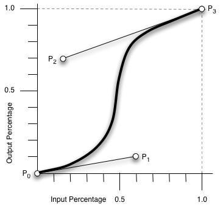

css3 animation effect : 

1. animation-timing-function

2. transition-timing-function

cubic-bezier: 三次贝塞尔 ，主要是animation 生成速度曲线的函数，规定是 

cubic-bezier('<x1>','<y1>','<x2>','<y2>');

上图标识了cubic-bezier的取值范围：

PO: 默认值(0, 0)
P1: 动态取值（x1, y1）
P2: 动态取值（x2, y2）
P3: 默认值（1，1）

可以在线做动画：

https://isux.tencent.com/css3/tools.html